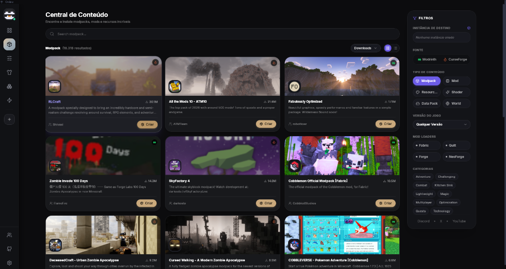

<div align="center">
  
  <h1>Luxmc Launcher <span style="color:#e2b86b">v1.6.0</span></h1>
  <p><strong>O Minecraft Launcher moderno, inteligente e de alta performance.</strong></p>
  <p><em>Rápido. Leve. Confiável. 100% gratuito e open-source.</em></p>

  <p>
    <a href="https://github.com/predabr/luxmc/releases"></a>
    
    
    
    
    
    <a href="LICENSE"></a>
  </p>
</div>

<br/>

<!-- Dashboard Principal -->
<div align="center">
  
  <p><em>Dashboard com modpacks em destaque, conexão rápida para servidores, rastreamento de tempo de jogo e notícias.</em></p>
</div>

<br/>

<!-- Galeria de Telas -->
<div align="center">
  <table style="border: none; border-collapse: collapse; width: 100%; max-width: 900px;">
    <tr>
      <td width="50%" align="center" style="padding: 8px; border: none;">
        
        <br/>
        <sub><strong>Central de Conteúdo:</strong> Busca unificada no Modrinth e CurseForge para modpacks, mods, shaders e resource packs.</sub>
      </td>
      <td width="50%" align="center" style="padding: 8px; border: none;">
        
        <br/>
        <sub><strong>Personalização 3D:</strong> Guarda-roupa volumétrico real, integração com NameMC e injeção automática no jogo.</sub>
      </td>
    </tr>
    <tr>
      <td colspan="2" align="center" style="padding: 8px; border: none;">
        
        <br/>
        <sub><strong>Criação de Instâncias:</strong> Modelos prontos de 1-Clique (Vanilla Otimizado, PvP, Survival, Modded) com seletor de loader e versão.</sub>
      </td>
    </tr>
  </table>
</div>

<br/>

---

## 🎮 O que é o Luxmc?

O **Luxmc** é um launcher de Minecraft moderno construído **em Rust (Tauri 2)** com interface reativa em **Svelte 5 + TypeScript + Tailwind CSS**. Projetado com foco em alta performance, estabilidade no Linux e suporte nativo ao Windows, ele oferece inicialização quase instantânea, consumo mínimo de memória e ferramentas completas para modding e personalização.

### Comparativo

| Recurso | Luxmc | Launcher Oficial | Launchers Baseados em Electron |
|---|---|---|---|
| **Consumo de RAM** | **~150-200 MB** | ~800 MB+ | ~500-800 MB |
| **Tempo de Inicialização** | **< 1.5s** | ~8-15s | ~6-12s |
| **Central de Mods** | ✅ Modrinth + CurseForge com downloads paralelos | ❌ | ⚠️ Parcial |
| **Alocação de Memória** | ✅ Inteligente (Aikar G1GC Flags + Auto RAM) | ❌ | ⚠️ Manual |
| **Personalização de Skins** | ✅ 3D Volumétrico + Capas + Injeção Nativa | ❌ | ⚠️ 2D apenas |
| **Modelos 1-Clique** | ✅ Vanilla Otimizado, PvP, Fabric, Forge, NeoForge | ❌ | ❌ |
| **Chat & P2P Local** | ✅ Chat Universal e P2P direto | ❌ | ❌ |
| **Tecnologia** | ✅ **Tauri 2 / Rust** | ❌ Electron / CEF | ❌ Electron |

---

## 🚀 Principais Recursos

### ⚡ Performance & Arquitetura
- **Engine Nativa em Rust:** Zero overhead do Chromium. Consumo de memória até 75% menor que launchers tradicionais.
- **Aceleração Gráfica por Hardware:** Suporte a DMA-BUF e Wayland/X11 no Linux e WebView2 no Windows.
- **Downloads Paralelos e Resilientes:** Motor multi-thread via `rayon` e `tokio` com verificação de hash instantânea.

### 🧩 Central de Conteúdo & Modloaders
- **Suporte Completo a Loaders:** Vanilla, Fabric, Forge, NeoForge e Quilt do Minecraft clássico até a versão mais recente.
- **Ecossistema Unificado:** Explore e instale milhares de modpacks, mods, resource packs, shaders e datapacks do **Modrinth** e **CurseForge** diretamente pelo launcher.
- **Resolução Automática de Dependências:** Instale mods complexos sem se preocupar com bibliotecas ausentes.

### 👕 Personalização de Skins & Capas 3D
- **Visualizador 3D Real:** Rotação 360°, suporte a modelos Classic (4px) e Slim (3px) com animação física suave.
- **Importador NameMC:** Carregue qualquer skin do mundo simplesmente digitando o nickname do jogador.
- **Capas 3D e Injeção no Jogo:** Escolha entre capas históricas ou importe sua própria textura com injeção automática em tempo de execução.

### ☕ Gerenciamento Inteligente de Java & Memória
- **Detecção e Download Automático:** O launcher identifica e providencia o Java adequado (Java 8, 17 ou 21) para a versão escolhida.
- **Aikar's Flags Otimizadas:** Configuração automática de garbage collection para eliminar engasgos (stuttering).
- **Editor de JVM Avançado:** Ajuste fino de parâmetros e limites de memória por instância.

### 🌐 Conexão Rápida & Ferramentas Integradas
- **Conexão Direta (Quick Join):** Entre nos seus servidores favoritos em 1-clique diretamente pelo launcher.
- **Chat P2P & Global:** Converse com amigos e compartilhe IPs de servidores sem intermediários.
- **Doctor de Erros & Telemetria:** Diagnóstico inteligente de conflitos de mods e relatórios claros de inicialização.

---

## 📥 Como Baixar e Instalar

Baixe o pacote correspondente ao seu sistema operacional na aba de **[📦 Releases Oficiais](https://github.com/predabr/luxmc/releases/latest)**.

### 🪟 Windows (10 / 11)
- Baixe o instalador **`Luxmc_x64-setup.exe`** ou **`Luxmc.exe`**.
- Execute o arquivo para iniciar o launcher.

### 🟢 Linux (AppImage — Universal)
Funciona em qualquer distribuição Linux:
```bash
chmod +x Luxmc_1.6.0_amd64.AppImage
./Luxmc_1.6.0_amd64.AppImage
```

### 🟣 Arch Linux / Manjaro
Instale via PKGBUILD nativo incluído no repositório:
```bash
cd packaging/arch
makepkg -si
```

### 🔴 Debian / Ubuntu / Pop!_OS (.deb)
```bash
sudo apt install ./Luxmc_1.6.0_amd64.deb
```

### 🔵 Fedora / openSUSE (.rpm)
```bash
sudo dnf install ./Luxmc-1.6.0-1.x86_64.rpm
```

---

## 🛠️ Compilando a partir do Código-Fonte

### Pré-requisitos

| Ferramenta | Versão Recomendada |
|---|---|
| **Node.js** | v20+ |
| **pnpm** | v9+ |
| **Rust** | 1.77+ (stable) |
| **WebKitGTK / GTK3** (Linux) | 4.1+ |

### Passo a Passo

```bash
# 1. Clone o repositório
git clone https://github.com/predabr/luxmc.git
cd luxmc

# 2. Instale as dependências do frontend
pnpm install

# 3. Execute em modo desenvolvimento (Live Reload)
pnpm tauri dev

# 4. Compile os binários de produção otimizados
pnpm tauri build
```

---

## 🏗️ Estrutura do Repositório

```
luxmc/
├── src/                          # Frontend SvelteKit (Svelte 5 + TS + Tailwind)
│   ├── lib/
│   │   ├── api/                  # Interfaces tipadas com Tauri commands
│   │   ├── components/           # Componentes modulares (UI, 3D, Instâncias, Mods)
│   │   └── stores/               # Estado reativo baseado em runes
│   └── routes/                   # Páginas da aplicação (Dashboard, Mods, Skins, etc.)
├── src-tauri/                    # Backend Rust (Tauri 2)
│   ├── src/
│   │   ├── core/                 # Motores de download, launchers, Java e verificações
│   │   ├── commands/             # Handlers expostos para a interface
│   │   └── lib.rs                # Inicialização e registro de módulos
│   ├── tests/                    # Suíte completa de testes de integração
│   └── Cargo.toml
├── packaging/                    # Scripts de empacotamento (Arch, Debian, RPM)
└── static/                       # Assets visuais e screenshots
```

---

## 📄 Licença

Distribuído sob a **Licença Luxmc Launcher** (Copyright © 2026 Pedro & Equipe Luxmc).  
Gratuito para uso pessoal e comunitário. Consulte [LICENSE](LICENSE) para detalhes completos.

<div align="center">
  <br/>
  <p><strong>Desenvolvido com carinho para a comunidade Minecraft.</strong></p>
  
</div>
