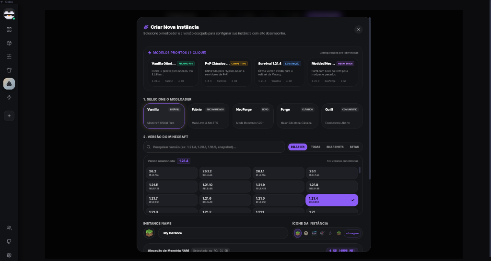

<div align="center">
  
  <h1>Luxmc <code>v1.7.6</code></h1>
  <p><strong>Launcher de Minecraft moderno, Linux-first, de alta performance.</strong></p>
  <p><a href="https://luxmc-r92.pages.dev"><strong>🌐 Site Oficial: luxmc-r92.pages.dev</strong></a></p>

  [](https://luxmc-r92.pages.dev)
  
  
  
  
  
  
</div>

---

## ✨ O que é o Luxmc?

O **Luxmc** é um launcher de Minecraft Linux-first desenvolvido com **Tauri 2 (Rust)** no backend e **SvelteKit + Svelte 5 Runes + TypeScript** no frontend. Consome próximo de 0% de CPU em segundo plano, tem consumo de RAM controlado com `malloc_trim` / `EmptyWorkingSet` automático, e oferece uma experiência premium sem depender de Java instalado no sistema — o launcher gerencia os runtimes automaticamente.

Para baixar a versão mais recente, personalizar capas em 3D ou ver novidades, acesse o [Portal Oficial do Luxmc](https://luxmc-r92.pages.dev).

---

## 🏗️ Arquitetura

```
Luxmc/
├── src/                        # Frontend SvelteKit (Svelte 5 Runes + TypeScript)
│   ├── routes/                 # Páginas: home, instances, mods, skins, friends...
│   └── lib/                    # Componentes, stores, API wrappers, i18n
├── src-tauri/                  # Backend Rust (Tauri 2)
│   └── src/
│       ├── commands/           # Handlers Tauri expostos ao frontend
│       ├── core/               # Launcher, loaders (Forge/NeoForge/Fabric), Java manager
│       └── db/                 # SQLite via sqlx (perfis, mods, skins, capas, logs)
└── static/                     # Assets estáticos (imagens, banners)
```

---

## 🚀 Funcionalidades Principais (v1.7.1)

| Funcionalidade | Detalhe |
|---|---|
| 🎮 **Multi-Loader** | Vanilla, Fabric, Forge, NeoForge, Quilt — instalação automática |
| 📦 **Importação Universal** | `.mrpack` (Modrinth), `.zip` (CurseForge manifest) com 1 clique |
| 🎨 **Skins & Capas In-Game** | Injeção via resource pack dinâmico — funciona offline e Microsoft, OptiFine, EMF/ETF |
| ☕ **Java Auto-Manager** | Detecta e baixa Temurin 8/17/21 via Mojang Runtime Manifest automaticamente |
| 🎵 **Discord RPC Nativo** | Windows Named Pipes + Linux Unix Socket — sem biblioteca externa, textos dinâmicos v1.7.1 |
| 👥 **Radar de Amigos P2P** | Status em tempo real (jogando, em servidor, online, offline) com Quick Join direto |
| 🔧 **Dependency Checker** | Detecta Fabric API, Cloth Config, Architectury faltando e instala com 1 clique |
| 📊 **Playtime Tracker** | Gráfico semanal de tempo jogado, sessão recorde, persistência SQLite |
| 🛡️ **Shield Scanner** | Detecta mods incompatíveis, conflitos JPMS, crashes comuns |
| ⚡ **Otimizador Aikar** | Flags JVM dinâmicas baseadas na RAM disponível e GPU detectada |
| 🖼️ **Screenshot Gallery** | Browser integrado de capturas da instância |
| 📸 **Gamer Card** | Exporta card estilo Spotify Wrapped com stats do jogador |
| 🌍 **MangoHud + GameMode** | Controles nativos Linux para overlay de FPS e prioridade de CPU |
| 🔒 **Wayland/XWayland** | Seletor por rádio — compatível com Hyprland, Sway, GNOME Wayland |
| 🧹 **Zero Memory Leak** | `malloc_trim` (Linux) / `EmptyWorkingSet` (Windows) + unlisten correto de eventos Tauri |

---

## 📸 Screenshots

| Home | Instâncias | Skins |
|---|---|---|
|  |  |  |

---

## 🛠️ Requisitos de Desenvolvimento

```bash
# Dependências do sistema (Linux)
sudo pacman -S webkit2gtk-4.1 gtk3 libappindicator-gtk3 librsvg
# ou Debian/Ubuntu:
sudo apt install libwebkit2gtk-4.1-dev libgtk-3-dev libayatana-appindicator3-dev librsvg2-dev

# Node / pnpm
node >= 20
pnpm >= 9

# Rust
rustup update stable
```

---

## ⚡ Comandos

```bash
pnpm install          # instalar dependências
pnpm tauri dev        # desenvolvimento com hot-reload
pnpm check            # svelte-check (0 erros)
pnpm build            # build estático do frontend
cd src-tauri && cargo test   # testes Rust (45+ passing)
pnpm tauri build      # AppImage / .deb / NSIS release
```

---

## 📄 Licença

Proprietário — © 2024-2026 Luxmc Contributors. Todos os direitos reservados.

---

<div align="center">
  <sub>Feito com ❤️ para a comunidade Linux + Minecraft</sub>
</div>
