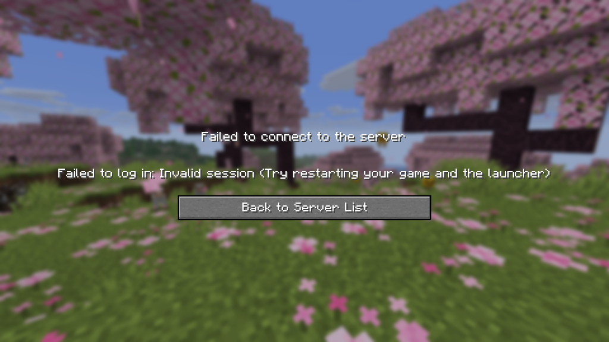
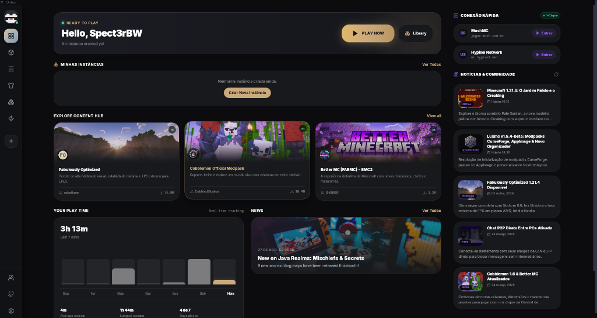
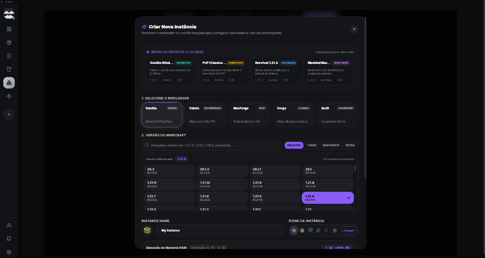

<div align="center">
  
  <h1>Luxmc <code>v2.0.0</code></h1>
  <p><strong>Launcher de Minecraft moderno, Linux-first e de altíssima performance.</strong></p>
  <p><a href="https://luxmc-r92.pages.dev"><strong>🌐 Site Oficial: luxmc-r92.pages.dev</strong></a></p>

  [](https://github.com/predabr/luxmc/releases/tag/v2.0.0)
  [](https://luxmc-r92.pages.dev)
  
  
  
  
  
  
  
</div>

---

## ✨ O que é o Luxmc?

O **Luxmc** é um launcher de Minecraft moderno construído do zero com **Tauri 2 (Rust)** no backend e **SvelteKit + Svelte 5 Runes + TypeScript** no frontend. Projetado com prioridade máxima para ambientes Linux sem comprometer a compatibilidade nativa no Windows e macOS, o Luxmc oferece inicialização instantânea, consumo residual de memória e total controle sobre as suas instâncias de Minecraft.

Todas as chamadas pesadas, verificações de arquivos, downloads paralelos e injeção de processos são executados nativamente em Rust assíncrono com Tokio, garantindo fluidez ininterrupta na interface gráfica mesmo durante o download de modpacks com centenas de mods.

---

## 🚀 Funcionalidades da Versão 2.0.0

| Recurso | Descrição |
|---|---|
| 🎮 **Multi-Loader Nativo** | Suporte completo a **Fabric**, **Forge**, **NeoForge**, **Quilt** e **Vanilla** com instalação em 1 clique |
| 🛡️ **CrashDoctor™ Auto-Heal** | Diagnóstico automático de crashes, sugestões de reparo inteligente e detecção de Java incompatível |
| 🛡️ **Mod Shield™** | Verificação prévia de integridade, compatibilidade JPMS e resolução automática de dependências ausentes |
| 📦 **Catálogo Unificado (50k+ Mods)** | Busca e instalação direta de mods e modpacks do **Modrinth** e **CurseForge** sem abrir o navegador |
| 🌐 **Multiplayer P2P Mesh** | Jogue mundos singleplayer com seus amigos via túnel criptografado ponto-a-ponto sem Hamachi ou abrir portas no roteador |
| 🎨 **Estúdio 3D de Skins & Capas** | Visualizador tridimensional interativo, suporte a capas em alta definição (PNG/WebP) sem distorção e capas clássicas |
| ☕ **Java Auto-Manager** | Download e configuração automática dos runtimes Eclipse Temurin (Java 8, 17, 21) |
| ⚡ **Otimizador Nativo de Memória** | Gestão ativa de memória via `malloc_trim` no Linux e `EmptyWorkingSet` no Windows |
| 🐧 **Integração Linux Completa** | Suporte refinado a **Wayland** e **X11**, **Feral GameMode**, **MangoHud** e registro automático de ícones no dock |
| 🔒 **Zero Telemetria** | 100% dos seus dados, senhas e configurações permanecem armazenados localmente na sua máquina |

---

## 📸 Demonstração Visual (v2.0.0)

<div align="center">

### Início & Central do Jogador


### Gerenciador de Instâncias & Modpacks


### Catálogo Unificado de Mods & Shaders


### Estúdio 3D de Skins & Capas Personalizadas


</div>

---

## 📥 Como Instalar

### 🐧 Linux

#### 1. Arch Linux / Manjaro / EndeavourOS
Instale diretamente pelo AUR com seu AUR helper favorito:
```bash
yay -S luxmc-launcher
# ou
paru -S luxmc-launcher
```

Ou instale o pacote `.pkg.tar.zst` diretamente via pacman:
```bash
sudo pacman -U https://github.com/predabr/luxmc/releases/latest/download/luxmc-2.0.0-1-x86_64.pkg.tar.zst
```

#### 2. Instalador Automático Universal (Qualquer Distribuição Linux)
Execute o comando de instalação oficial no terminal:
```bash
curl -fsSL https://luxmc-r92.pages.dev/install.sh | bash
```

#### 3. AppImage Portátil
Baixe o [Luxmc_2.0.0_amd64.AppImage](https://github.com/predabr/luxmc/releases/latest/download/Luxmc_2.0.0_amd64.AppImage), conceda permissão de execução e inicie:
```bash
chmod +x Luxmc_2.0.0_amd64.AppImage
./Luxmc_2.0.0_amd64.AppImage
```

#### 4. Ubuntu / Debian / Pop!_OS / Linux Mint
Baixe e instale o pacote `.deb`:
```bash
sudo dpkg -i Luxmc_2.0.0_amd64.deb
```

#### 5. Fedora / RHEL / openSUSE
Baixe e instale o pacote `.rpm`:
```bash
sudo rpm -i Luxmc-2.0.0-1.x86_64.rpm
```

---

### 🪟 Windows

Baixe o instalador oficial executável:
- **Instalador NSIS**: [Luxmc_2.0.0_x64-setup.exe](https://github.com/predabr/luxmc/releases/latest/download/Luxmc_2.0.0_x64-setup.exe)

Dê um duplo clique no instalador e siga o assistente. O Luxmc configurará automaticamente os atalhos da área de trabalho e menu Iniciar.

---

### 🍎 macOS

- **Universal DMG (Apple Silicon & Intel)**: [Luxmc_2.0.0_universal.dmg](https://github.com/predabr/luxmc/releases/latest/download/Luxmc_2.0.0_universal.dmg)

Abra o arquivo `.dmg` e arraste o **Luxmc** para a sua pasta **Aplicativos**.

---

## 🏗️ Estrutura do Projeto

```
Luxmc/
├── src/                        # Interface SvelteKit (Svelte 5 Runes + TypeScript + Tailwind)
│   ├── routes/                 # Rotas: / (home), /instances, /mods, /skins, /friends, /news...
│   └── lib/                    # Componentes modulares, stores reativas, API wrappers Tauri
├── src-tauri/                  # Backend Nativo Rust (Tauri 2)
│   └── src/
│       ├── commands/           # Handlers expostos com validação estrita de tipos
│       ├── core/               # Motores de inicialização, downloaders paralelos, Java manager
│       ├── db/                 # Banco local SQLite (perfis, mods, skins, histórico, logs)
│       └── network/            # Túnel P2P Mesh, status de servidores e ping nativo
├── packaging/                  # Especificações de empacotamento (Arch PKGBUILD, DEB, RPM, NSIS)
├── static/                     # Recursos gráficos e capturas de tela do launcher
└── website/                    # Portal oficial estático e documentação
```

---

## 🛠️ Compilação e Desenvolvimento Local

### Pré-requisitos
- **Node.js**: `>= 22`
- **pnpm**: `>= 10`
- **Rust**: Versão estável via `rustup`

```bash
# 1. Instalar dependências de build
pnpm install

# 2. Executar em modo de desenvolvimento com hot-reload
pnpm tauri dev

# 3. Verificação de tipos no frontend
pnpm check

# 4. Verificação de integridade no Rust
cargo check --manifest-path src-tauri/Cargo.toml

# 5. Gerar pacote de lançamento da sua plataforma atual
pnpm tauri build
```

---

## 📄 Licença

Proprietário — © 2024-2026 Luxmc Contributors. Todos os direitos reservados.

<div align="center">
  <sub>Construído com excelência para a comunidade global de Minecraft.</sub>
</div>
