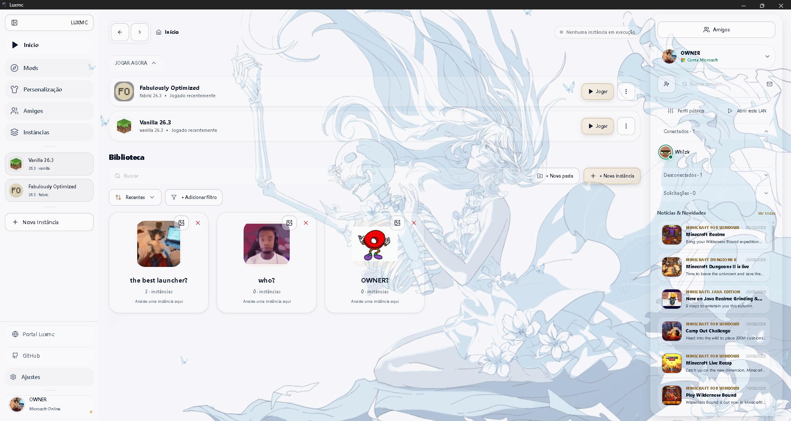
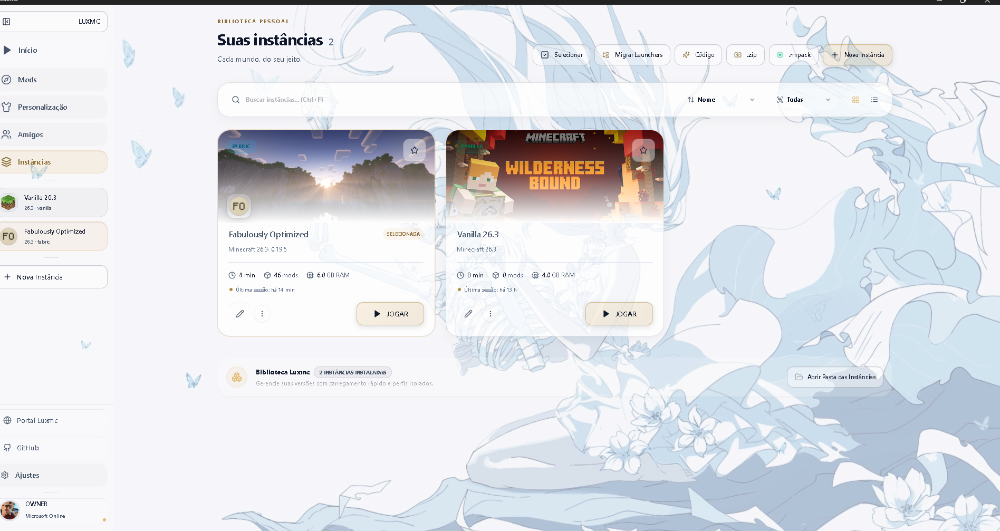
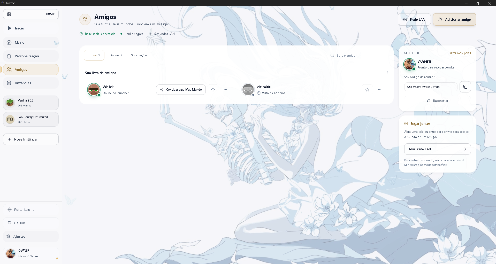

<div align="center">
  
  <h1>Luxmc 3.6</h1>
  <p>Seu Minecraft, suas instâncias e sua turma.</p>
  <p><a href="https://luxmc-r92.pages.dev">Site oficial</a> · <a href="https://github.com/predabr/luxmc/releases/latest">Downloads</a> · <a href="SECURITY.md">Segurança</a></p>
</div>

Luxmc reúne versões Java, modpacks, organização de instâncias, personalização e recursos sociais. O backend usa Rust e Tauri 2; a interface usa Svelte 5 e TypeScript. O projeto tem raízes no Linux e instalador nativo para Windows.

## Instalação

- **Windows:** [instalador oficial](https://luxmc-r92.pages.dev/download/windows).
- **Linux:** escolha AppImage, DEB, RPM ou pacote Arch nas [releases](https://github.com/predabr/luxmc/releases/latest). Use o formato correspondente à sua distribuição.
- **macOS:** consulte os artefatos da release. A disponibilidade de um pacote não equivale a uma validação de todas as funções naquele sistema.

Baixe apenas dos canais oficiais. O atualizador da versão 3.6 verifica o manifesto assinado e o hash do arquivo antes de executar uma atualização. A assinatura de distribuição Ed25519 não substitui a assinatura Authenticode do Windows. Veja [SECURITY.md](SECURITY.md).

## Biblioteca e conteúdo

Cada instância Java conserva seus mods, mundos e configurações em sua própria pasta. Crie pastas com nome e imagem para organizar a biblioteca e arraste as instâncias para dentro delas.

O catálogo integra Modrinth e CurseForge. Importe `.mrpack` e pacotes CurseForge, confira versões e changelogs e instale o conteúdo na instância escolhida. Downloads conferem hashes quando o provedor os disponibiliza. Reparos preservam arquivos desativados pelo usuário. A disponibilidade dos arquivos depende dos provedores e das permissões de distribuição de cada autor.

Vanilla, Fabric, Forge, NeoForge e Quilt têm fluxos próprios de preparação. Java, memória, resolução e argumentos podem ser definidos por instância. Logs, diagnósticos, backups e histórico ajudam a investigar problemas; não existe garantia de que qualquer combinação de mods funcione.

## Amigos e aparência

Perfis públicos podem incluir nome de exibição, status, descrição, imagens e GIFs. As informações compartilhadas com amigos dependem das permissões e da conexão com o portal. Skins de contas Microsoft são sincronizadas pelo serviço oficial; capas locais não se tornam capas oficiais da conta.

A sala LAN usa uma rede virtual criptografada. O anfitrião abre um mundo para LAN no Minecraft; o convidado usa o acesso ao mundo oferecido pelo Luxmc. Os participantes precisam usar edições, versões e mods compatíveis. Firewall, antivírus, disponibilidade do relay e condições de rede podem interferir. A estabilidade em duas redes distintas precisa ser validada com os dois computadores.

## Bedrock no Windows

O catálogo distingue versões estáveis, Preview e betas, além dos formatos UWP e GDK. Pacotes são obtidos dos servidores Microsoft e a instalação mantém a verificação do Windows. Uma conta offline do Luxmc não substitui uma licença de Minecraft para Windows.

O Windows gerencia a identidade do pacote Bedrock. Instâncias gerenciadas pelo Luxmc têm uma página própria para mundos, pacotes de recursos e add-ons, com pastas isoladas e importação de conteúdo. Antes de trocar versões, o Luxmc preserva uma cópia dos dados existentes. Betas ou pacotes antigos podem deixar de estar disponíveis ou exigir acesso ao programa correspondente. A importação de instalações antigas do BedrockLauncher continua disponível como opção.

Versões GDK usam Gaming Services. O Luxmc prepara esse componente oficial quando necessário; a primeira abertura pode incluir descompactação pelo Windows. A entrada na conta Microsoft ocorre nos serviços oficiais do Windows.

## Interface

Temas, wallpaper e ajustes visuais são configuráveis. As telas e abas têm transições curtas; movimento reduzido e efeitos desativados são respeitados. Ativar animações explicitamente permite usá-las com movimento reduzido no Windows; o modo de desempenho usa uma transição breve de opacidade. O fundo e o tema recuperam a gravação mais recente das preferências.

A [revisão 2 da 3.6](docs/releases/v3.6.1-revision.2.md) reúne os ajustes de exclusão, download e preparação Java, conteúdos Bedrock por instância, perfis públicos personalizados e novos controles de animação. A escolha de edição, os filtros de versões e a tela de amigos receberam refinamentos. A exclusão Java só remove o registro após apagar os arquivos. Versões Bedrock gerenciadas podem ser desinstaladas do Windows e ter seu pacote removido. A opção de apagar dados no desinstalador remove dados do Luxmc e preserva Documentos e o projeto; uma atualização mantém suas instâncias. O instalador é distribuído como **Lux MC Launcher.exe**.

Capturas fornecidas pelo autor em 9 de outubro de 2026:







Os [resultados de verificação da revisão 2](docs/releases/validation-v3.6-revision.2.md) registram testes de interface, instalação, um modpack real e abertura Bedrock. A partida LAN entre duas redes distintas ainda precisa do retorno dos participantes. O site publica uma medição local da 3.6 com as condições e dados completos, sem prometer consumo fixo.

## Desenvolvimento

Requisitos: Node.js 22 ou superior, pnpm, Rust e dependências nativas do Tauri. No Windows, use a toolchain MSVC e Visual Studio Build Tools. No Linux, instale GTK, WebKitGTK e demais dependências da distribuição.

```sh
pnpm install
pnpm check
pnpm build
cargo check --manifest-path src-tauri/Cargo.toml
pnpm tauri dev
```

O site usa fontes TypeScript em `site-client/` e `site-server/`; `pnpm build:website` gera os arquivos em `website/`. `pnpm test:website` valida contas, catálogo, downloads, mídia e interface. O comando de build do Windows é `pnpm build:windows`.

## Licença e identidade

O repositório público permite auditoria e estudo. A licença própria em [LICENSE](LICENSE) restringe revenda e uso indevido da identidade visual. Código público pode ser copiado; nenhuma proteção técnica elimina essa possibilidade. Versões modificadas devem respeitar os termos e não se apresentar como distribuição oficial. Consulte [BRANDING.md](BRANDING.md).

Bibliotecas, componentes de rede, conteúdo dos packs, imagens dos usuários e marcas de terceiros mantêm suas licenças e titulares. Luxmc não é um produto oficial de Minecraft nem é aprovado ou associado à Mojang ou à Microsoft.
